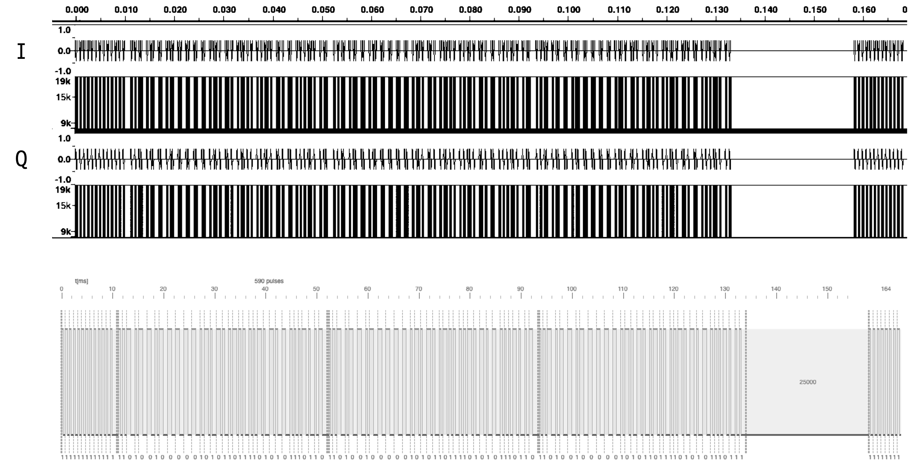

# sub-to-c16

## Features

Flipper Zero *.sub file to HackRF *.C16 data converter

> 🚧 Project still under development and likely to be changed in the future

> Currently only supports the [`RAW`](https://github.com/flipperdevices/flipperzero-firmware/blob/dev/lib/subghz/protocols/raw.c) protocol.

## Motivations

The freshly available *Flipper Zero* has a huge community behind that uploads a lot of recorded-remotes files for many use-cases (HVAC, office lights, smart plugs, Tesla...).

This tool will perform the time-to-signal conversion and generate both `C16` and `TXT` files that you can save on the HackRF's SD card and use them later.

## Requirements

Node.js >= 14

## Usage

```bash
npm start -- -f <input_file.sub> -if <intermediate_freq> -a <amplitude_in_%> -sr <sampling_rate> -o <output_file.type>
```

- Only the `-f` parameter is required. If no output path is specified (`-o`), the input file name will be used for both `C16` and `TXT` output files.

- Output file in the `C16` extension means that the output files has pairs of complex `[I,Q]` signals, encoded on 16-bit signed integers.

- Phase between `I` and `Q` is 90° (fixed).

- If no amplitude percentage is supplied (`-a`), `100` is used by default.

- If no sampling rate for the output file is supplied (`-sr`), `500ks/s` is used by default.

- If no intermediate frequency is supplied (`-if`), its value will be `sampling rate / 100`.

> Why an intermediate frequency? This is how SDR-based platforms works. You can refer to the following schematic.


## Example

Used sample is this [Tesla charge port opener sub file](https://github.com/Cocainer/ClippingFracks/blob/main/Sub-GHz/Vehicles/Tesla/BEST_PORT_OPENER/433.92MHz_AM650_Better_Tesla_Charge_Port_Opener.sub)

- Amplitude is *40%* of the maximum allowed
- Modulation frequency is *19Khz*
- Sampling rate is *250ks/s*

```bash
npm start -- -f 433.92MHz_AM650_Better_Tesla_Charge_Port_Opener.sub -if -a 40 -f 19000 -sr 250000 -o out
```

Below is the comparison between the C16 `[I,Q]` data and the sub file preview on [lab.flipper.net](https://lab.flipper.net/pulse-plotter)



The HackRF's metadata file will have the following lines:

```
sample_rate=250000
center_frequency=433920000
```

# References

- https://github.com/eried/portapack-mayhem/wiki/C16-format

- https://github.com/flipperdevices/flipperzero-firmware/blob/dev/lib/subghz/protocols/

- https://lab.flipper.net/pulse-plotter

